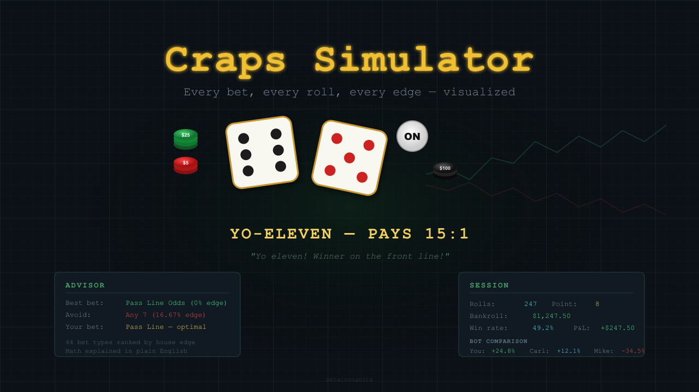
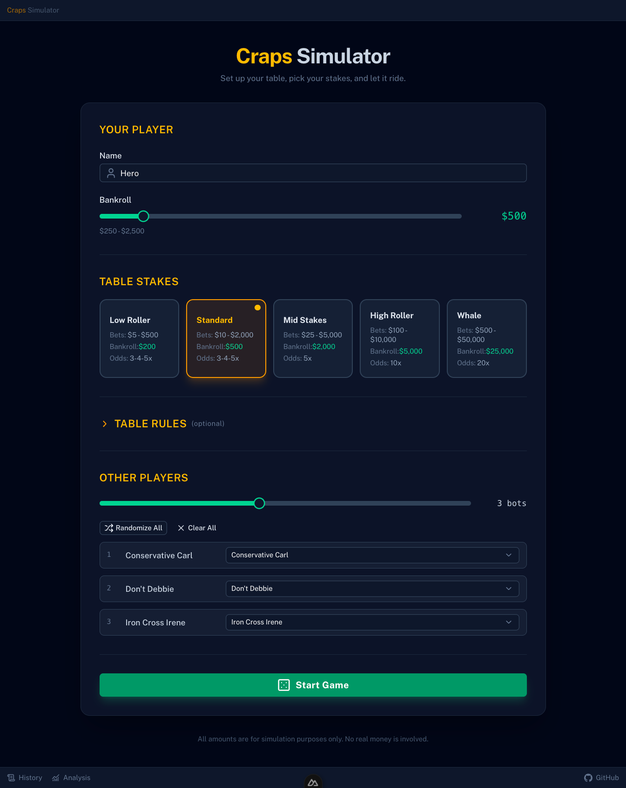
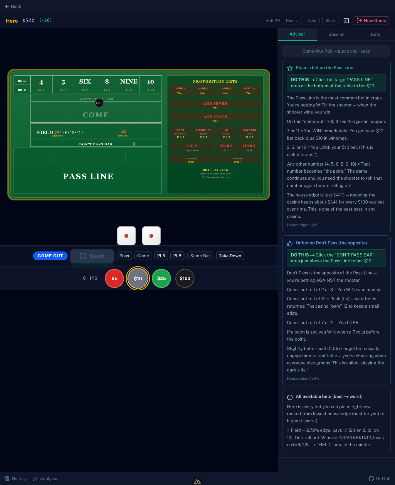

# Craps Simulator



A visual, interactive casino craps simulator that plays like a real table — not a spreadsheet. Place chips on an emerald felt layout, watch the dice tumble, and learn why the Pass Line is your best friend and Any 7 is a trap. A built-in advisor coaches you through every roll, explains the math in plain English, and ranks every bet on the board from best to worst so you never have to guess.

Play at your own pace, or flip on auto-roll and rapid mode to grind through thousands of rolls and watch the house edge converge in real time. No money, no pressure, no judgment — just you, the dice, and the math.

> **This is a single-player simulation only.** No real money is wagered, won, or lost. There is no multiplayer, no server, no accounts, and no connection to any casino or gambling service. All bankrolls and payouts are fictitious. The sole purpose is education — learning craps strategy, bet math, and house edge through interactive practice.

### Setup



### Table



## Features

- **Full visual craps table** — interactive SVG layout with every betting zone, animated dice, chip stacks, and an ON/OFF puck that moves with the point
- **Real-time advisor with one-click actions** — a teaching coach that tells you exactly what to bet, where to click, and why, with every option ranked from best (0% edge) to worst (16.67% edge) in plain English. Click any "DO THIS" recommendation to instantly place that bet.
- **44 bet types** — every standard casino craps wager: Pass, Don't Pass, Come, Odds, Place, Buy, Lay, Field, Hardways, Props, Horn, C&E, Big 6/8, and Hop bets
- **Rapid play + auto-roll** — skip animations and auto-roll on a timer to simulate hundreds of rolls per minute and watch the statistics converge
- **Same Bet button** — one click re-places your previous bet configuration for steady grinding
- **8 bot co-bettors** — watch Conservative Carl, Martingale Mike, Iron Cross Irene, and five other named strategies play alongside you with their own bankrolls
- **Session stats** — roll distribution charts, per-bet-type win/loss tracking, P&L over time, point conversion rates, and gambler's fallacy warnings
- **Configurable everything** — 5 stake levels ($5–$500 tables), odds multiples (1x to 100x), field payouts, vig timing, payout rounding
- **Study mode** — pause the game and hover over any zone for a detailed explanation: bet name, house edge, how it works, and whether you have chips on it. Learn the entire layout without risking a roll.
- **History + analysis pages** — full roll-by-roll log, roll distribution chart (actual vs. expected), per-bet-type W/L/P breakdown, point conversion rate, and net P&L tracking. Navigate freely — game state is preserved.
- **Mathematically verified** — integer-cent arithmetic prevents rounding errors, chi-squared validated dice, house edge convergence tests for every bet type. Payout math reviewed against MBS rules for all 44 bet types including C&E (2-unit split), Horn (4-unit), Horn High (5-unit), and Hop bets.
- **Casino atmosphere** — dark emerald felt, gold accents, stickman calls ("Seven out! Line away!"), and floating payout animations

## Rules Reference

Game rules are cross-validated against multiple authoritative sources:

| Source | Type | Link |
|--------|------|------|
| **Marina Bay Sands Craps Game Rules (Version 3)** | Government-approved casino rules (Singapore GRA) | [MBS-Craps-Game-Rules-Version-3.pdf](docs/MBS-Craps-Game-Rules-Version-3.pdf) |
| **Colorado Division of Gaming Rule 23** | US state law — 44 named bet types, payout rules | [1 CCR 207-1-23 (Cornell Law)](https://www.law.cornell.edu/regulations/colorado/1-CCR-207-1-23) |
| **Wikimedia Commons Craps Table Layout** | Reference SVG for table geometry (CC BY-SA 3.0) | [Craps_table_layout.svg](docs/Craps_table_layout.svg) |

The MBS document is the canonical (tie-breaking) reference for all bet resolution, working/off rules, and edge cases. See the [Rules Reference Sources](docs/craps-sim-rules-reference-sources.md) design doc for the full cross-validation analysis.

## Tech Stack

| Layer | Choice |
|-------|--------|
| Framework | [Nuxt 4](https://nuxt.com) (`ssr: false` — client-side SPA) |
| UI | [Nuxt UI v4](https://ui.nuxt.com) + [Tailwind CSS v4](https://tailwindcss.com) |
| State | [Pinia](https://pinia.vuejs.org) (single store) |
| Language | TypeScript (strict) |
| Testing | [Vitest](https://vitest.dev) |
| Deployment | [Netlify](https://netlify.com) (static) |

## Getting Started

```bash
pnpm install
pnpm dev
```

Open [http://localhost:3000](http://localhost:3000).

## Build

```bash
pnpm generate
```

Output goes to `.output/public/` for static deployment.

## Testing

```bash
pnpm test
```

The test suite includes:
- Dice distribution chi-squared uniformity test (100K+ rolls)
- House edge convergence tests for every bet type
- Payout precision tests with integer-cent arithmetic
- Come bet lifecycle state machine tests
- Seven-out cascade resolution tests

## Project Structure

```
app/
├── pages/           # Setup (/), Table (/table), History (/history), Analysis (/analysis)
├── layouts/         # Default layout with top/bottom status bars
├── components/
│   ├── setup/       # Setup page components
│   ├── table/       # Game table components (CrapsTable, DicePair, ControlBar, etc.)
│   └── stats/       # Advisor & stats panel
├── composables/     # Game engine (dice, bets, payouts, game loop, advisor)
├── stores/          # Single Pinia store (useCrapsStore)
└── utils/           # BetType enum, formatting, sanitization
craps.config.ts      # Master config (stakes, payouts, odds, bots)
docs/                # 13-document design suite + MBS rules PDF
```

## Design Documentation

The `docs/` directory contains a 13-document design suite:

| Doc | Title | Description |
|-----|-------|-------------|
| [Doc 00](docs/craps-sim-doc00-master-design.md) | Master Design | Project overview, tech stack, complete bet catalog, game state machine |
| [Doc 01](docs/craps-sim-doc01-phase1-visual-foundation.md) | Phase 1 — Visual Foundation | Table SVG, dice, chips, puck, setup screen |
| [Doc 02](docs/craps-sim-doc02-phase2-dice-engine.md) | Phase 2 — Dice Engine | Dice generation, bet resolution, payout calculator, statistical validation |
| [Doc 03](docs/craps-sim-doc03-phase3-game-loop.md) | Phase 3 — Game Loop | Playable game, auto-roll, same bet, payout animations, shooter rotation |
| [Doc 04](docs/craps-sim-doc04-phase4-bot-systems.md) | Phase 4 — Bot Systems | 8 bot co-bettors with real betting strategies |
| [Doc 05](docs/craps-sim-doc05-phase5-stats-phase6-polish.md) | Phase 5+6 — Stats & Polish | Stats panel, advisor, animations, responsive design |
| [Doc 06](docs/craps-sim-doc06-security.md) | Security | Threat model, CSP, input sanitization, dependency supply chain |
| [Doc 07](docs/craps-sim-doc07-llm-build-prompt.md) | LLM Build Prompt | Context document for LLM-assisted development |
| [Doc 08](docs/craps-sim-doc08-competitive-landscape.md) | Competitive Landscape | Survey of existing simulators and differentiation |
| [Doc 09](docs/craps-sim-doc09-monorepo-website.md) | Monorepo / Website | Deployment architecture and build pipeline |
| [Doc 10](docs/craps-sim-doc10-revision-gap-analysis.md) | Revision / Gap Analysis | Design gaps, pre-build bugs, post-phase reviews |
| [Doc 11](docs/craps-sim-doc11-architecture-decisions.md) | Architecture Decisions | 10 ADRs with rationale and alternatives considered |
| [Doc 12](docs/craps-sim-doc12-use-cases.md) | Use Cases | 4 personas, 10 detailed use cases with acceptance criteria |

Supporting documents:

| Doc | Description |
|-----|-------------|
| [Rules Reference Sources](docs/craps-sim-rules-reference-sources.md) | Cross-validation of 5 rules sources with payout verification |
| [Audit Report](docs/craps-sim-audit-report.md) | Pre-build statistical audit (3 bugs found and fixed) |
| [Craps Education for Poker Players](docs/craps-education-for-poker-players.md) | Pedagogical guide for the target audience |
| [Addendum: SPA, Setup, Table, Security](docs/craps-sim-addendum-spa-setup-table-security.md) | Clarifications on SPA mode, setup page spec, table rendering |
| [MBS Craps Game Rules v3](docs/MBS-Craps-Game-Rules-Version-3.pdf) | Canonical rules reference (Singapore GRA approved, Feb 2020) |
| [Craps Table Layout SVG](docs/Craps_table_layout.svg) | Wikimedia reference SVG (geometry only — not used in production) |

## Changelog

See [CHANGELOG.md](CHANGELOG.md) for version history.

## License

[MIT](LICENSE)
